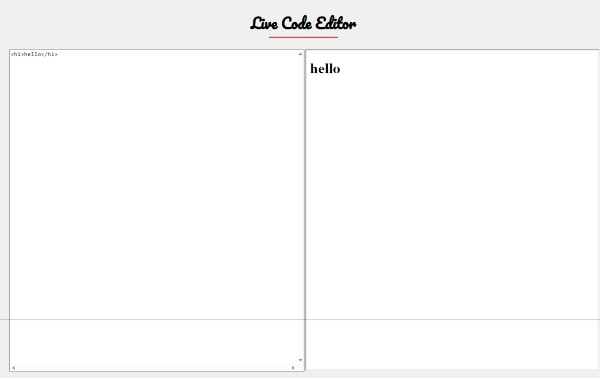

# 🚀 Live HTML Editor

> Welcome to the **Live HTML Editor** – your simple, fast, and efficient tool for live HTML editing!

  

## 🍒 Features

📱 **Mobile Friendly**: Experience seamless editing and previewing on all your devices.

⚡️ **Fast and Efficient**: Enjoy instant updates and responsiveness for efficient code editing.

📝 **Simple and Intuitive**: An easy-to-use interface for writing and previewing your HTML code.

🔧 **Full Control**: Complete control over your HTML code, all in a single file.

👜 **Tiny Size**: Minimalist approach with a lightweight codebase.

🧪 **Powered by Alpine.js**: Harness the power of Alpine.js for dynamic interactions.

## 🌐 Usage

**Visit [https://arnavk-09.github.io/live-html/](https://arnavk-09.github.io/live-html/) to use this tool.**

## ⚔️ Assemble Locally 
1. Clone the repository: `git clone https://github.com/ArnavK-09/live-html.git`
2. Open `index.html` in your preferred browser.
3. Write your HTML code in the editor and see the live preview instantly!

## 📸 Preview 

---

Made with ❤️ by
<a href="https://github.com/ArnavK-08">ArnavK-09</a>

---